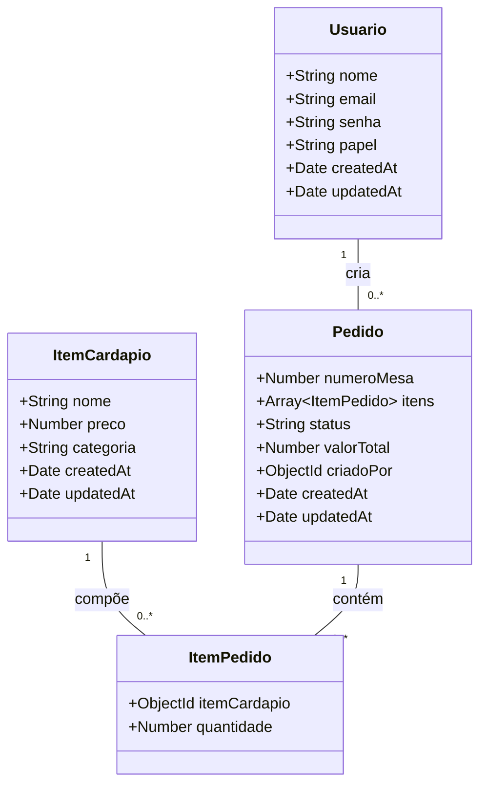
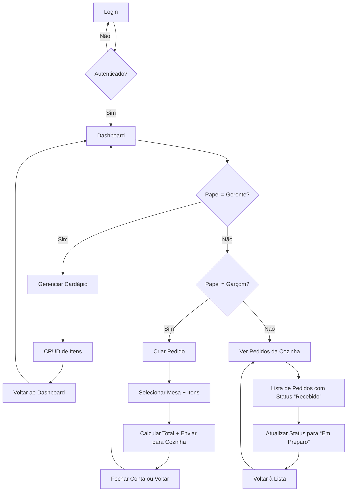

# 🍽️ Sistema de Gestão de Pedidos para Restaurante  
**Cliente:** Pequeno Bistrô Sabor Local  
**Projeto:** MVP para digitalização de pedidos em ambiente de restaurante  

---

## 📌 Visão Geral

O sistema substitui o processo manual de anotação de pedidos em papel por uma solução digital segura e eficiente. Ele permite que garçons criem pedidos diretamente de tablets ou dispositivos móveis, os enviem para a cozinha em tempo real e acompanhem o status de preparo. O gerente pode gerenciar o cardápio e visualizar relatórios de faturamento.

---

## ✅ Requisitos Funcionais (RF)

| ID  | Descrição |
|-----|-----------|
| RF-01 | O sistema deve permitir o cadastro, leitura, atualização e exclusão de itens do cardápio (nome, preço, categoria). |
| RF-02 | O sistema deve permitir que um garçom crie um novo pedido associado a um número de mesa. |
| RF-03 | O sistema deve permitir adicionar múltiplos itens a um pedido, com quantidade personalizável. |
| RF-04 | O sistema deve calcular automaticamente o valor total do pedido com base nos preços dos itens. |
| RF-05 | O pedido deve ter um status: `Recebido`, `Em Preparo` ou `Entregue`. |
| RF-06 | A tela da cozinha deve exibir todos os pedidos com status `Recebido`, ordenados por data/hora de criação. |
| RF-07 | O cozinheiro deve poder atualizar o status do pedido para `Em Preparo`. |
| RF-08 | O garçom ou gerente deve poder fechar a conta (mudar status para `Entregue`). |
| RF-09 | O gerente deve visualizar o faturamento total (soma de todos os pedidos com status `Entregue`). |
| RF-10 | O sistema deve autenticar usuários com e-mail e senha. |
| RF-11 | O sistema deve autorizar funcionalidades com base no papel do usuário: `gerente`, `garcom`, `cozinha`. |

---

## 🛡️ Requisitos Não Funcionais (RNF)

| ID  | Descrição |
|-----|-----------|
| RNF-01 | O sistema deve ser acessível via navegador web em dispositivos móveis e desktops. |
| RNF-02 | A autenticação deve usar JWT com criptografia segura (HS256). |
| RNF-03 | As senhas devem ser armazenadas com hash (bcrypt, custo 12). |
| RNF-04 | O tempo de resposta para criação ou atualização de pedido deve ser inferior a 1 segundo. |
| RNF-05 | O sistema deve suportar até 50 pedidos simultâneos sem degradação de desempenho. |
| RNF-06 | A interface deve ser intuitiva, com foco em usabilidade para garçons e cozinheiros. |
| RNF-07 | O banco de dados deve ser MongoDB (NoSQL) com persistência garantida. |
| RNF-08 | O código-fonte deve seguir arquitetura limpa com separação clara entre controllers, models e rotas. |

---

## 🧩 Diagramas

### Diagrama de Classes

### Casos de Uso:

---

### Caso de Fluxo/Navegação
