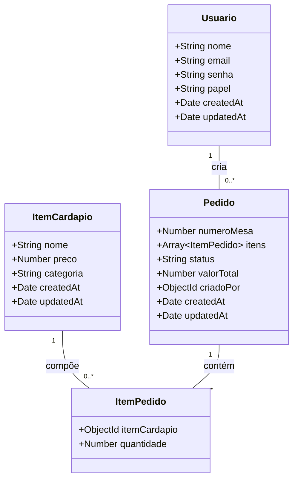
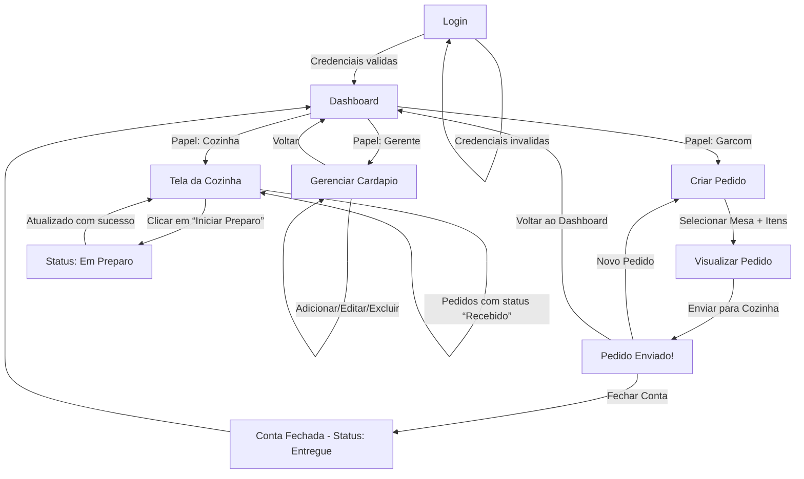
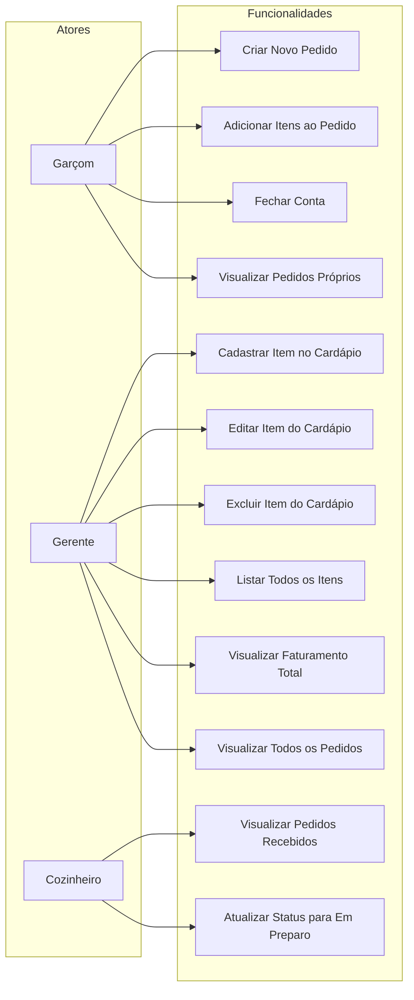

# 🍽️ Sistema de Gestão de Pedidos para Restaurante  
**Cliente:** Pequeno Bistrô Sabor Local  
**Projeto:** MVP para digitalização de pedidos em ambiente de restaurante  

---

## 📌 Visão Geral

O sistema substitui o processo manual de anotação de pedidos em papel por uma solução digital segura e eficiente. Ele permite que garçons criem pedidos diretamente de tablets ou dispositivos móveis, os enviem para a cozinha em tempo real e acompanhem o status de preparo. O gerente pode gerenciar o cardápio e visualizar relatórios de faturamento.

---

## ✅ Requisitos Funcionais (RF)

| ID  | Descrição |
|-----|-----------|
| RF-01 | O sistema deve permitir o cadastro, leitura, atualização e exclusão de itens do cardápio (nome, preço, categoria). |
| RF-02 | O sistema deve permitir que um garçom crie um novo pedido associado a um número de mesa. |
| RF-03 | O sistema deve permitir adicionar múltiplos itens a um pedido, com quantidade personalizável. |
| RF-04 | O sistema deve calcular automaticamente o valor total do pedido com base nos preços dos itens. |
| RF-05 | O pedido deve ter um status: `Recebido`, `Em Preparo` ou `Entregue`. |
| RF-06 | A tela da cozinha deve exibir todos os pedidos com status `Recebido`, ordenados por data/hora de criação. |
| RF-07 | O cozinheiro deve poder atualizar o status do pedido para `Em Preparo`. |
| RF-08 | O garçom ou gerente deve poder fechar a conta (mudar status para `Entregue`). |
| RF-09 | O gerente deve visualizar o faturamento total (soma de todos os pedidos com status `Entregue`). |
| RF-10 | O sistema deve autenticar usuários com e-mail e senha. |
| RF-11 | O sistema deve autorizar funcionalidades com base no papel do usuário: `gerente`, `garcom`, `cozinha`. |

---

## 🛡️ Requisitos Não Funcionais (RNF)

| ID  | Descrição |
|-----|-----------|
| RNF-01 | O sistema deve ser acessível via navegador web em dispositivos móveis e desktops. |
| RNF-02 | A autenticação deve usar JWT com criptografia segura (HS256). |
| RNF-03 | As senhas devem ser armazenadas com hash (bcrypt, custo 12). |
| RNF-04 | O tempo de resposta para criação ou atualização de pedido deve ser inferior a 1 segundo. |
| RNF-05 | O sistema deve suportar até 50 pedidos simultâneos sem degradação de desempenho. |
| RNF-06 | A interface deve ser intuitiva, com foco em usabilidade para garçons e cozinheiros. |
| RNF-07 | O banco de dados deve ser MongoDB (NoSQL) com persistência garantida. |
| RNF-08 | O código-fonte deve seguir arquitetura limpa com separação clara entre controllers, models e rotas. |

---

## 🧰 Análise de Recursos

### Recursos Humanos
- **Desenvolvedor Full-Stack (eu)**: responsável por todo o ciclo de desenvolvimento (frontend, backend, banco de dados, testes).
- **Cliente (Pequeno Bistrô Sabor Local)**: fornece requisitos, valida funcionalidades e testa o MVP.

### Recursos Tecnológicos
- **Frontend**: Next.js (App Router), React, CSS  
- **Backend**: Next.js API Routes, Node.js  
- **Banco de Dados**: MongoDB (Mongoose)  
- **Autenticação**: JWT (JSON Web Tokens) + Bcrypt (hash de senhas)  
- **Ambiente de Desenvolvimento**: VS Code, Git, npm 
- **Infraestrutura**: Execução local (localhost)

### Recursos de Infraestrutura
- Computador com acesso à internet 
- MongoDB
- Node.js v18+ instalado  

### Ferramentas de Apoio
- **Mermaid Live Editor**: para validação e visualização de diagramas   
- **Figma**: para criação de protótipos visuais
---

## ⚠️ Análise de Riscos

| Risco | Impacto | Probabilidade | Mitigação |
|-------|--------|---------------|----------|
| **Falta de internet no restaurante** | Alto | Média | O sistema será desenvolvido para funcionar **online**, mas com mensagens claras de erro. Futuramente, pode-se explorar modo offline com cache local (fora do MVP). |
| **Usuários não se adaptarem à interface** | Médio | Alta | Interface será **simples, intuitiva e focada na tarefa** (ex: botões grandes, fluxo linear). Testes com usuários reais serão feitos no MVP. |
| **Perda de dados por falha no banco** | Alto | Baixa | Utilização do **MongoDB com persistência em disco**. Recomenda-se backup manual periódico (fora do escopo do MVP). |
| **Vazamento de credenciais de login** | Alto | Baixa | Senhas armazenadas com **bcrypt (hash seguro)**. JWT com tempo de expiração curto (1 dia) e sem armazenamento em cookies persistentes. |
| **Desempenho lento com muitos pedidos** | Médio | Média | Otimização de consultas com **índices no MongoDB** e paginação futura (não necessária no MVP, pois volume é pequeno). |
| **Erros de cálculo no valor total do pedido** | Alto | Baixa | Cálculo feito **exclusivamente no backend**, com validação de preços no momento da criação do pedido. |
| **Confusão entre papéis de usuário** | Médio | Média | Validação rigorosa de **roles (papéis)** em todas as rotas de API e redirecionamento automático no frontend conforme o papel. |

---
## 🧩 Diagramas:

### Diagrama de Classes:

---

### Diagrama de Fluxo/Navegação

---

### Diagrama de Uso

